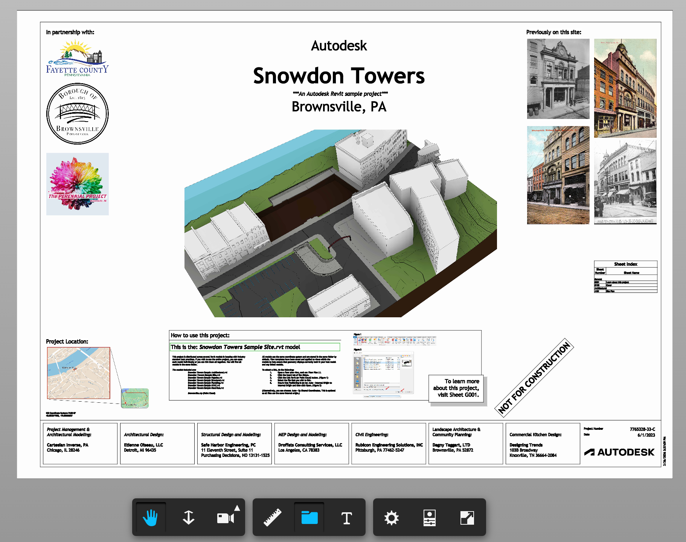
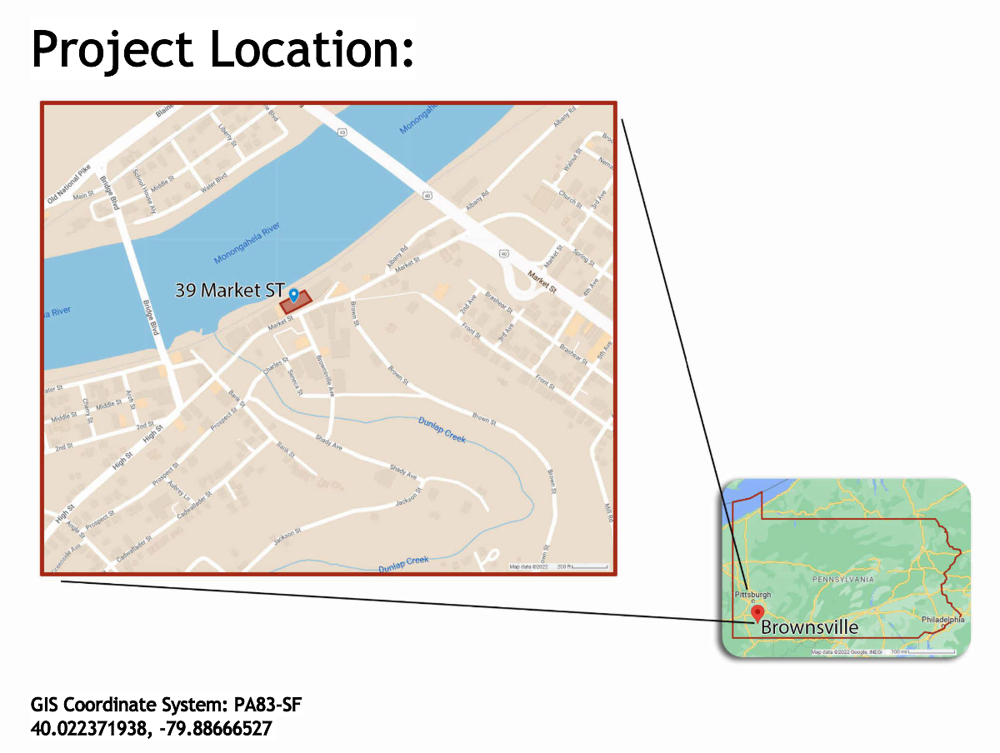

# Putting Revit on a Map — Compositing APS Viewer with MapLibre

**What if you could drop a full BIM model onto an open-source web map — not as a glTF 3D mesh, but rendered by the actual APS Viewer engine?**


Three weeks ago I was at the Esri Developer Summit in Palm Springs. [George Owen](https://www.esri.com/arcgis-blog/author/gowen) took the stage to demo the [MapLibre ArcGIS Plug-in](https://registration.esri.com/flow/esri/26epcdev/deveventportal/page/detailed-agenda/session/1761020020865001l0Ts) — Esri's official bridge for bringing [ArcGIS services into MapLibre GL JS](https://developers.arcgis.com/maplibre-gl-js/) ([blog post](https://www.esri.com/arcgis-blog/products/platform/developers/new-maplibre-gl-js-plugin-for-open-source-developers)). It was compelling. Esri is investing in open-source mapping, and MapLibre's `CustomLayerInterface` is the hook that makes it possible.

I walked out of that session thinking: *could MapLibre share the webGL context with APS Viewer ?*

I've been exploring BIM + GIS for a while now. Earlier I used [geo-three](https://github.com/wallabyway/geo-three-ext) to render Esri's terrain tiles into the geo-three / three.js scene. But terrain and geoThree is limited to distance and no vector tile maps or 3D buildings.

This post describes what happened when I tried to render an Autodesk Revit model on a MapLibre map by making MapLibre and LMV (Autodesk's internal viewer engine) share a single WebGL context. Not a screenshot overlay. Not an iframe. **Two renderers, one canvas, one depth buffer.**

### Live Demo

> **[Try it live →](https://wallabyway.github.io/viewer-plus-maplibre/)**

https://github.com/user-attachments/assets/377ce842-117e-4b36-a3ad-d8a9ed42810f


---

## Setup & Running

```bash
cd blog
npm install
npm run dev
```

This starts a Vite dev server on `http://localhost:5180` with a proxy to the APS public demo API (no API key required). Open the URL shown in the terminal.

The demo loads the **Snowdon Towers** Revit model from Autodesk's sample bucket and places it on a MapLibre map with 3D terrain at Brownsville, PA. Use the dropdown to switch between available models. The LMV viewer UI (toolbar, model browser, properties panel) is overlaid on the map.




Geo-pinned in [`main.mjs`](https://github.com/wallabyway/viewer-plus-maplibre/blob/55fcaa06413022b6920e712fad5c4f1e03911252/main.mjs#L28-L32):

```javascript
const modelOrigin = [-79.88666527, 40.022371938];
const modelAltitude = 10;
const modelRotationDeg = 30;
```

### Requirements

- Node.js 18+
- A modern browser with WebGL2 support

---

## The Approach

MapLibre GL JS supports custom WebGL layers through its `CustomLayerInterface`. You register a layer object with `onAdd()` and `render()` methods. Inside `render()`, you receive the raw `WebGL2RenderingContext` and MapLibre's view-projection matrix. You can draw whatever you want.

The APS Viewer SDK (aka LMV) uses three.js revision 71 as its rendering engine. We extract LMV's constructor from a throwaway instance and create a new one targeting MapLibre's canvas.

The full technique breaks down into five parts:

### [Part 1: Sharing a Single WebGL Context](docs/01-shared-webgl-context.md)

Two renderers on one canvas. The WebGL state machine is global — after each renderer draws, we reset everything R71 doesn't touch:

```javascript
glr.resetGLState();
gl.bindVertexArray(null);
gl.bindBuffer(gl.ARRAY_BUFFER, null);
gl.bindBuffer(gl.ELEMENT_ARRAY_BUFFER, null);
gl.bindFramebuffer(gl.FRAMEBUFFER, null);
gl.useProgram(null);
```

### [Part 2: Bootstrapping LMV's Renderer](docs/02-renderer-bootstrapping.md)

LMV's renderer class isn't on any public namespace. The trick: create a throwaway instance, grab the constructor, destroy it:

```javascript
const temp = new Autodesk.Viewing.Viewer3D(div);
temp.start();
const RendererClass = temp.impl.glrenderer().constructor;
temp.finish();
```

### [Part 3: Camera Synchronization](docs/03-camera-synchronization.md)

A Revit model is in feet, MapLibre in Mercator. The **relative-to-eye (RTE)** technique keeps Float32 precise — tiny offsets instead of absolute coordinates:

```javascript
const model64 = new Float64Array([
   s * cosR, -s * sinR, 0, 0,
  -s * sinR, -s * cosR, 0, 0,
   0,         0,        s, 0,
   dx,        dy,       dz, 1
]);
const result = mulMat4Float64(vpCentered, model64);
cam.projectionMatrix.elements.set(new Float32Array(result));
```

### [Part 4: Transparency and Compositing](docs/04-transparency-and-compositing.md)

LMV's blit overwrites the map. We intercept `gl.disable(BLEND)` to force alpha compositing during `presentBuffer`:

```javascript
const origDisable = gl.disable.bind(gl);
gl.disable = function(cap) {
  if (forceBlend && cap === gl.BLEND) return;
  origDisable(cap);
};
```

### [Part 5: Adding 2D — AutoCAD Drawings on the Map](docs/05-adding-2d-drawings.md)

LMV's 2D pipeline uses MSDF/SDF shaders driven by a `pixelsPerUnit` uniform. Our `skipCameraUpdate = true` blocks the only code path that updates it:

```
tick()
  └─ skipCameraUpdate? ──YES──> SKIPPED (no pixel scale update)
                          NO ──> updateCameraMatrices()
                                   └─ matman.updatePixelScale(ppu, w, h, camera)
```

---

## The Result

A Revit building rendered on a MapLibre map at Brownsville, PA. The model is geo-pinned — pan, zoom, and rotate the map and the building moves with it. MapLibre's 3D extruded buildings render alongside. 

The entire implementation is under 300 lines across two files (`main.mjs` and `lmv-loader.mjs`).


---

## Source

The complete source code for this demo is in this repository. The key files:

- [`main.mjs`](main.mjs) — MapLibre custom layer, camera sync, model loading
- [`lmv-loader.mjs`](lmv-loader.mjs) — LMV initialization, renderer injection, transparency patches
- [`index.html`](index.html) — Minimal UI with model picker
